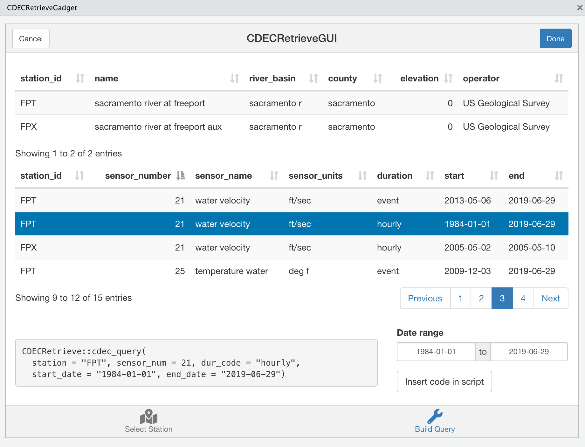

# CDECRetrieveGUI

A map-based interface to the [`CDECRetrieve` package](https://github.com/FlowWest/CDECRetrieve). The goal of this [Shiny Gadget](https://shiny.rstudio.com/articles/gadgets.html) is to aid discovery of [CDEC](http://cdec.water.ca.gov) gaging stations, sensors available at each station, and dates of availability.

### Prerequisites

Installation requires the R package `devtools` and a working development environment (see https://github.com/hadley/devtools).

```
install.packages("devtools")
```

An internet connection is required both to display the map and retrieve data from CDEC. 

### Installation

`CDECRetrieveGUI` is only available through Github.

```
devtools::install_github("fishsciences/CDECRetrieveGUI")
```

### Basic Usage

After installing the `CDECRetrieveGUI` package, a menu item is added to the Addins dropdown menu in RStudio. Selecting `CDECRetrieveGUI` from the Addins menu will launch the `CDECRetrieveGadget`. Alternatively, you can launch the gadget by running the following code in RStudio.

```
CDECRetrieveGUI::CDECRetrieveGadget()
```

Station locations are mapped by selecting a county from the dropdown menu in the top right corner of the `CDECRetrieveGadget`. When the gadget is first launched, `Sacramento` is selected from the county dropdown menu,  `CDECRetrieve::cdec_stations(county = "SACRAMENTO")` is run, and results are mapped. Clicking on a circle displays the Station ID in a popup and selects the station for use on the `Build Query` tab. 


Because more than one station can have the same lat/lon coordinates, it is not possible to select those stations separately from the map. Thus, when a station is selected, all other stations with the same lat/lon coordinates are included on the `Build Query` tab. The top table on the `Build Query` tab shows the station metadata. The bottom table shows the sensor data for the selected station(s). When the gadget is first launched, `FPT` and `FPX` are the selected stations. The sensor table is populated by calling `CDECRetrieve::cdec_datasets(station)` for each station. 
Clicking on a row in the sensor table updates the date range picker and generates the code to query CDEC with `CDECRetrieve::cdec_query()`. [Warning: By default, the date range picker uses the start and end dates for the selected row from the sensor table, which might generate long-running queries.] The `cdec_query()` code block can be copy and pasted into an R script or the R console. Alternatively, clicking on `Insert code in script` will insert the code at the location of the cursor in the R script window. When the gadget is running, though, you can't change the location of the cursor so you need to place the cursor appropriately before launching the gadget.   




